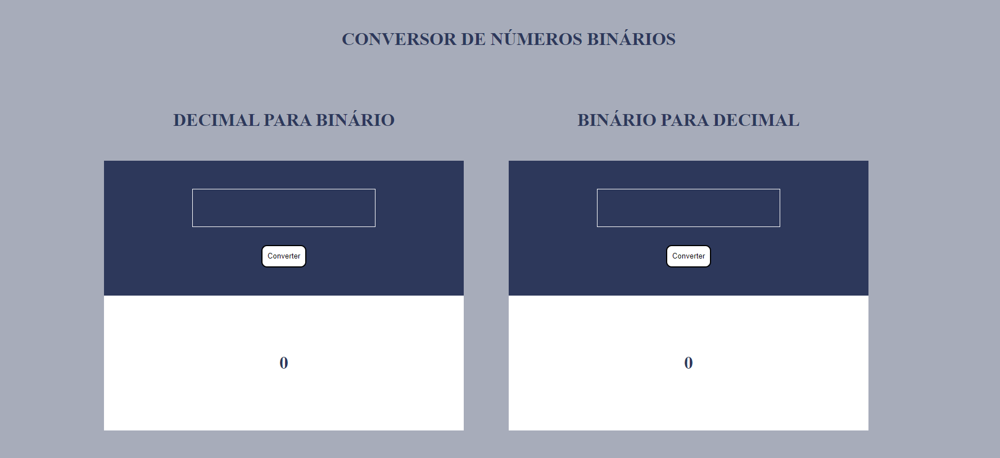
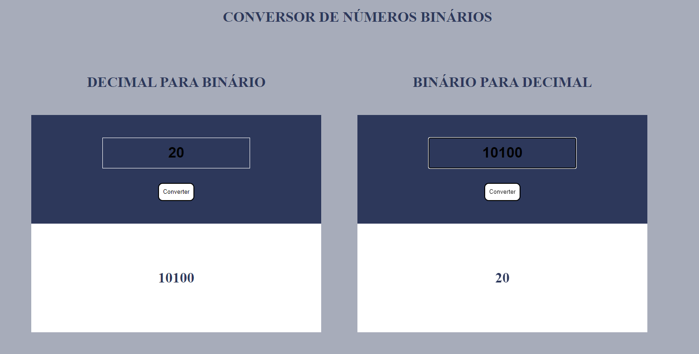

## Conversos Binário 

- No primeiro quadro consiste em um conversor de números Decimais para Binário 
- No primeiro quadro consiste em um conversor de números Binário para Decimais 

### Tecnologias Ultilizadas 💻
- HTML
- CSS
- JavaScript

### Conferir Projeto

- [Clique para ver projeto.](https://willian-py.github.io/BinDec/)

### Autor 

-  [Willian Lopes](https://github.com/Willian-Py)

